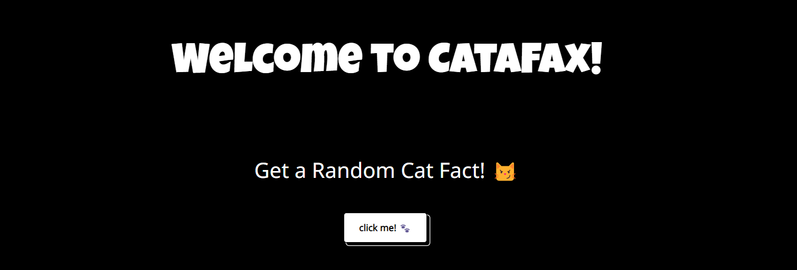

# 🐾 CataFact · [](https://github.com/HarshilShrma/CataFax) 

> Instant random cat facts with a playful twist  

[](https://harshilshrma.github.io/CataFax/)
[](LICENSE)

<p align="center">
  
  <br>
  <a href="https://harshilshrma.github.io/CataFax/">
    
  </a>
</p>

---

## ✨ Features  
- **🐱 API-Powered Facts**: Fetches random cat trivia from public APIs  
- **🔊 Meow Button**: Interactive sound effect on click  
- **⚡ Async Loading**: Smooth content fetching with `async/await`  
- **📱 Responsive**: Works on all device sizes  

## 🛠 Tech Stack  


## 🚀 Quick Start  
1. Clone the repo:  
   ```bash
   git clone https://github.com/HarshilShrma/CataFax.git
