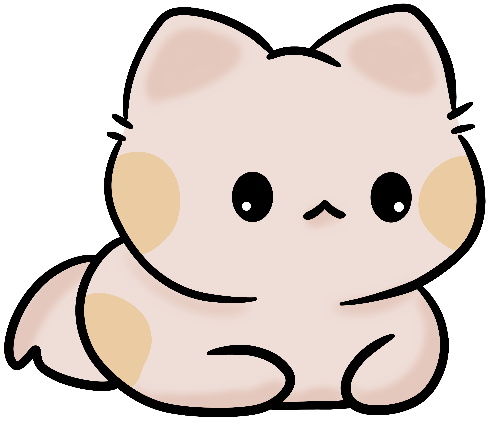

# 🐈 CataFax 

> A delightful cat fact generator with playful interactions

[](https://jk-77.github.io/CataFax/)
[](https://github.com/JK-77/CataFax/blob/main/LICENSE)

<p align="center">
  <a href="https://jk-77.github.io/CataFax/">
    
    <br>
    <em>Tap the cat to play!</em>
  </a>
</p>


## 🛠 Technologies Used

<div align="center">
  <a href="https://skillicons.dev">
    
  </a>
</div>

## ✨ Features
- **🐱 Random Cat Facts**: Fresh feline trivia on demand
- **🔊 Interactive Meows**: Playful sound effects
- **⚡ Instant Loading**: Async API fetching
- **🌈 Vibrant UI**: Eye-catching design

## 🚀 Quick Start
```bash
git clone https://github.com/JK-77/CataFax.git
cd CataFax
open index.html
